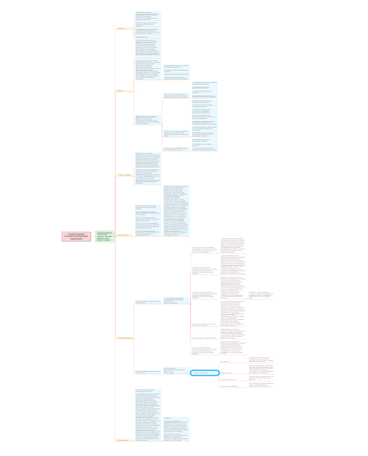

# Практическая работа № 5

## Цель работы

Изучить ГОСТ по защите информации и познакомиться с построением mind-карты

### Ход работы

1. Для построения mind-карты был взят ГОСТ Р 59710-2022 Защита информации. Управление компьютерными инцидентами. Общие положения.

     Ссылка на документ - https://docs.cntd.ru/document/1200194356 
2. Была использована программа Xmind

3. Результат

#### Оценка результата

Был изучен ГОСТ Р 59710-2022 Защита информации. Управление компьютерными инцидентами. Общие положения и была построена mind-карта в программе Xmind.

##### Вывод

Таким образам был изучет ГОСТ и познакомились с посторением mind-карт.
